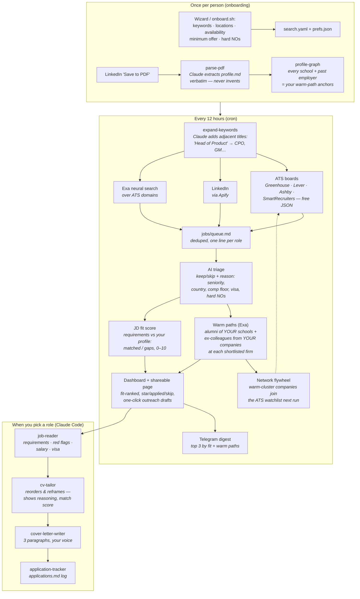

# How ve-forwardrole works — and why each tool is in the stack

The system has one job: **get a short list of roles worth your time, with a warm
way in, and an application that sounds like you.** Everything below exists to
serve that, and nothing here mass-applies — quality over volume is a design
constraint, not a slogan.

## The workflow

A day in the life: the 07:00 run finds 40 roles across three sources, triage
kills 25 (wrong seniority, below your comp floor, no sponsorship), the 15
survivors get fit scores and warm paths, your dashboard re-ranks, and your
morning Telegram says *"1. Product Lead @ Canary · fit 9/10 · 5 warm paths."*
You star two, skip six (they never come back — skips are remembered), draft an
outreach message to the ex-colleague who works at your top pick, and tailor one
application in Claude Code. Ten minutes, all signal.

## Why these tools — and not alternatives

| Tool | What it does here | Why this one |
|---|---|---|
| **Claude / Claude Code** | Parsing, triage, tailoring, cover letters, outreach drafts | The work is *judgment*, not retrieval: "is Director-level right for this person", "reframe without inventing". The agents enforce hard rules (never fabricate experience) that a template engine can't. Claude Code specifically because the repo IS the interface — agents + CLAUDE.md load automatically, no app to build for Tier 1. |
| **ATS public JSON** (Greenhouse/Lever/Ashby/SmartRecruiters) | Bulk discovery from a company watchlist | The only **free, unlimited, ToS-clean** source. These boards are public APIs by design. One watchlist company = its entire board every run. This is the default source precisely because it needs no account. |
| **Apify** (LinkedIn jobs) | Keyword/location discovery on LinkedIn | LinkedIn has **no public jobs API** and aggressively blocks scrapers (999s). Apify runs maintained actors with rotating infrastructure — you rent the cat-and-mouse game instead of playing it. Optional by design: drop it and ATS+Exa still feed you. |
| **Exa** | Neural search: off-LinkedIn roles, **and the warm-path graph** (alumni + ex-colleagues per company) | Keyword engines can't answer *"people who worked at Mastercard now at Pagaya"* or *"Cornell alumni at Datadog with senior product titles"* — Exa's semantic search over the indexed web (including profile pages) can, with per-result fact summaries we verify before showing. This is the feature that turns a job list into a network strategy. |
| **PocketBase** | Dashboard auth + users | A **single binary** with auth, admin UI, and migrations built in. The alternative is running Postgres + an auth service for what is ~5 user rows per instance. One `./pocketbase serve`, done. |
| **Next.js (standalone)** | The dashboard | One self-contained `node server.js` on the box — no container, no platform lock-in. Build on a laptop, rsync the bundle. |
| **git + GitHub PRs** | The queue's change log | Every discovery run is a commit/PR, so the robot's decisions are **reviewable and revertable** — you can see exactly what it added, when, and why a role was skipped. A database would hide that; a markdown file in git makes the robot auditable by reading the diff. |
| **cron** | Scheduling | The pipeline is a chain of idempotent scripts; cron is the boring, debuggable choice. (One sharp edge documented in the README: `%` is special in crontab lines — keep commands in scripts.) |
| **Telegram** | The morning digest | Push that reaches you without building a mobile app: one BotFather token, one HTTP call. Optional. |
| **here.now** | Password-protected shareable shortlist | A mentor or recruiter can see your curated list via one URL + password, without getting a login to your dashboard. Optional. |

## The design principles behind the choices

1. **Degrade gracefully.** Every external dependency is optional; removing a
   key removes a capability, never the system. The free tier (ATS boards +
   Claude Code) is a complete product.
2. **Bring your own model.** The LLM layer resolves `LLM_BASE_URL` (any
   OpenAI-compatible gateway — OpenRouter, local Ollama, Groq) →
   `ANTHROPIC_API_KEY` → `OPENAI_API_KEY`. You're never locked to one vendor,
   and a local Ollama runs the brain for free.
3. **Files over databases.** Profiles, queue, decisions, enrichment — all
   markdown/JSON in the repo. Greppable, diffable, yours. The only database
   (PocketBase) holds logins, nothing else.
4. **Never invent.** The parser and tailor are constitutionally forbidden from
   fabricating skills, dates, or jobs. Tailoring reorders and reframes what's
   true. This is enforced in the agent prompts and the skill.
5. **Private by default.** Each instance is sovereign: your operator, your box,
   your data. No telemetry, no shared backend, and the README's first warning
   is to keep your copy private.
